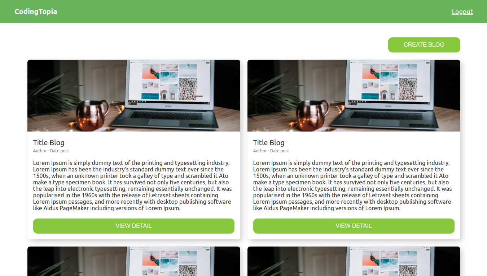
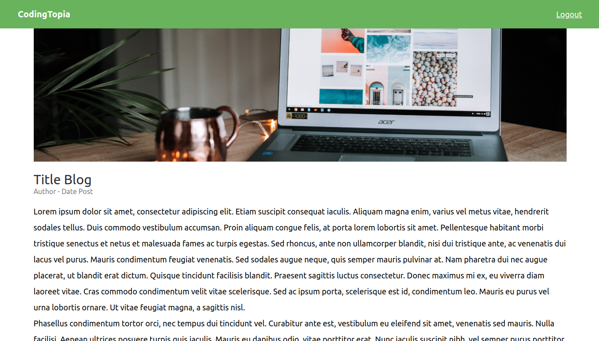

# blog-mern
Built Blog app using M.E.R.N Stack MongoDB, Express, React JS, Node JS

<!-- - learning resource => (0:00/16:00) 34 - Cara Upload Image / Photo di NodeJS 
https://www.youtube.com/watch?v=ewWjphek2d0&list=PLU4DS8KR-LJ0-MT2QfV-fvJiNorsoFs74&index=35&ab_channel=prawitohudoro -->

## Home page.

## Detail Blog page.

